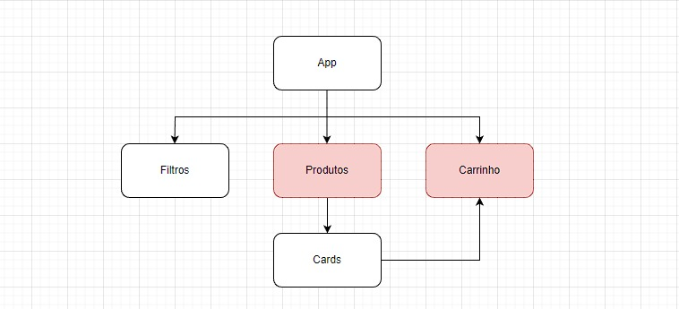

#h1 Fase inicial do nosso projeto LabECommerce.
No arquivo js temos no mock com os primeiros produtos que iremos adicionar.
Abaixo em markdow temos imagens da nossa arvore de componentes e arvore de componentes com sequencia que imaginamos ter os estados.

